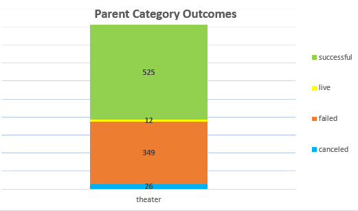
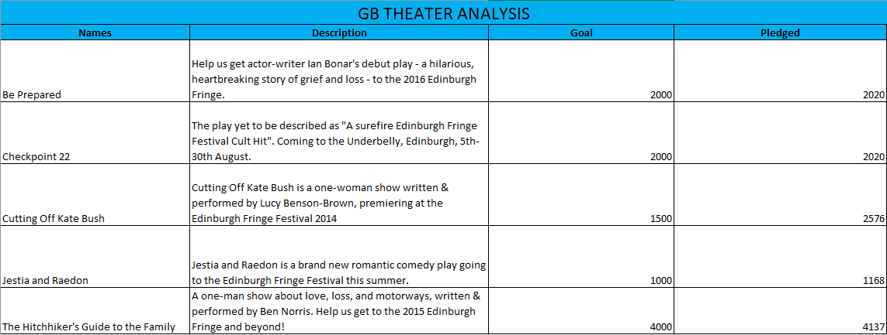
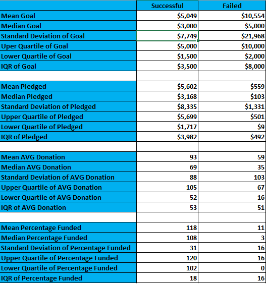

# Kickstarter-Analysis
## An analysis uncovering trends of Kickstarter Data from around the world 

### Submitted by: Jeanine Jordan, Class: Bootcamp: UCF-VIRT-DATA-PT-06-2022-U-B-TTH, Module 1 Challenge

**Introduction**

The compiled Kickstarter data this analysis is based on measures a multitude of factors pertaining to different Kickstarter campaigns from around the world. Some of the measured factors include the currency values of goals and pledged amounts for each campaign, deadline and launch dates, percentages funded, the currency value of average donations, as well as categories, subcategories and descriptions identifying what each campaign is.  

This analysis provides the viewer with a clear view of data concerning goals and goals versus pledged currency value data, as well as a deeper understanding of subcategory outcomes for theater productions. The spreadsheet, written analysis and images below assist the viewer in determining the best time of the year to hold a production, the recommended goal a production should be budgeted at as well as data comparing failed and successful productions. Planning future Kickstarter productions while using these trends and historical data increases the chance of success.   

This analysis focuses on the subjects below that correlate to sheets present in the Kickstarter Challenge Workbook:
* Kickstarter
* Category and subcategory outcome analysis
* Edinburgh Research
* Successful US Kickstarters and Failed US Kickstarters
* Descriptive Analysis
* Great Britain Musical Analysis
* Theater Outcomes by Launch Date
* Outcomes Based on Goals

**Analysis Breakdown**

The Kickstarter sheet houses all data that is examined throughout this analysis. Here, all columns and categories of the measured data can be seen. 

The Category and subcategory outcome analysis sheet observes the breakdown of the US theater production outcomes, as well as the breakdown of outcomes for the recorded plays within the US theater category. In the charts below, it is evident that the successful productions far outweigh all other outcomes. In the line chart, we observe trends over time for the outcomes of US theater productions and see the numbers of productions decrease dramatically after the year 2016. Alternatively, we see a massive peak in theater productions during the year 2013. The line chart depicting successful outcomes by months indicates it may be most advantageous for productions to occur during the months of May to August. 

The Edinburgh Research sheet displays a requested analysis on the following Great Britain theater productions: Be Prepared, Checkpoint 22, Cutting Off Kate Bush, Jestia and Raedon, and the Hitchhiker’s Guide to the Family. Alongside the descriptions of these productions, we can view the goals and pledged currency values. Here, we observe the most successful production to be the Hitchhiker’s Guide to the Family. 

The Successful US Kickstarters and Failed US Kickstarters sheets list only data for successful and failed US Kickstarter projects respectively. 

The Descriptive Analysis sheet displays the descriptive statistics data for the US Kickstarter campaigns. Here it is observed that the failed US Kickstarter goals outweigh the successful Kickstarter results. The standard deviation is high indicating that the data measured is more spread out numerically and varied more than the results for successful goals. Alternatively, the failed US Kickstarter productions pledged dollar amounts are reported to be much less than the successful US Kickstarter pledged amounts. The standard deviations for both the failed and successful productions are high indicating the wide spread of high and low numbers being measured. 

The Great Britain Musical Analysis sheet displays a box-and-whisker plot measuring the pledged versus goal currency amounts for musical productions in Great Britain. We can see the 4060 mean goal and observe the outlier data in the chart to determine that the production should have a goal at or under 4060.

The Theater Outcomes by Launch Data sheet analyzes the theater outcomes based on launch dates for all countries. The line chart depicting successful outcomes by months indicates it may be most advantageous for productions to occur during the months of May to August. Alternatively, we can see that January is the least successful month for theater productions and holds the most cancellations and failed productions. 

The Outcomes Based on Goals sheet depicts numeric breakdowns for the successful, failed, and cancelled Kickstarter productions in all countries. We observe an overall report of 60% successful projects and 40% failed projects. Here, the breakdown also tallies the numbers of Kickstarter productions in different currency value brackets. The majority of all reported productions had goals less than 1000. 

**Conclusion**

Overall, we observe that successful productions generally occurred within the months of May and August and were executed with goals between 4000 and 5000. The outcomes based on goals table encompasses a broad area of data that could be narrowed down by production type or region. While the broad dataset examined provides useful knowledge, it is also limiting. A deeper analysis of data narrowed down by production type and country would likely provide the viewer with more useful data if planning a future project.  Additional graphing and correlating percentage values in the pivots of this workbook would also provide more useful data to the viewer. 
